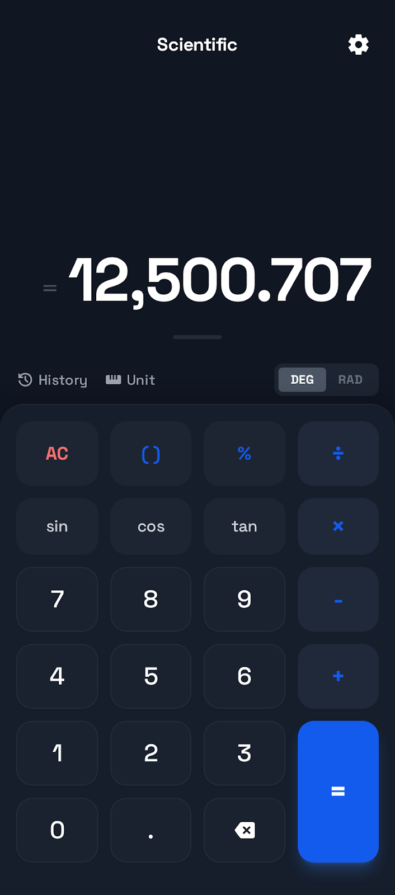
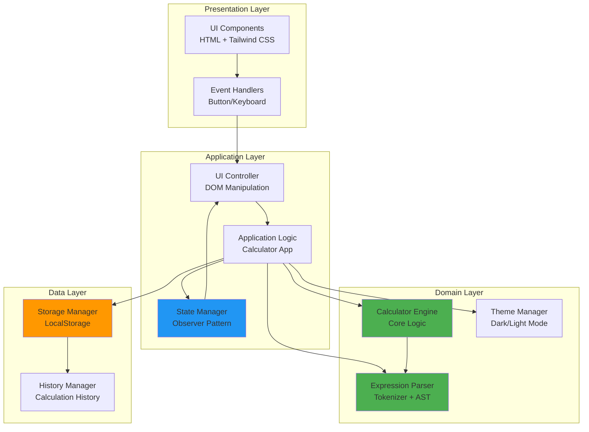
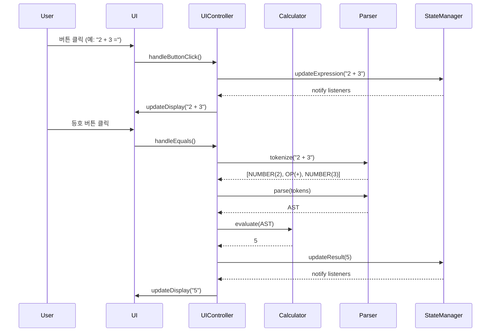
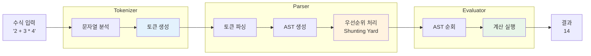
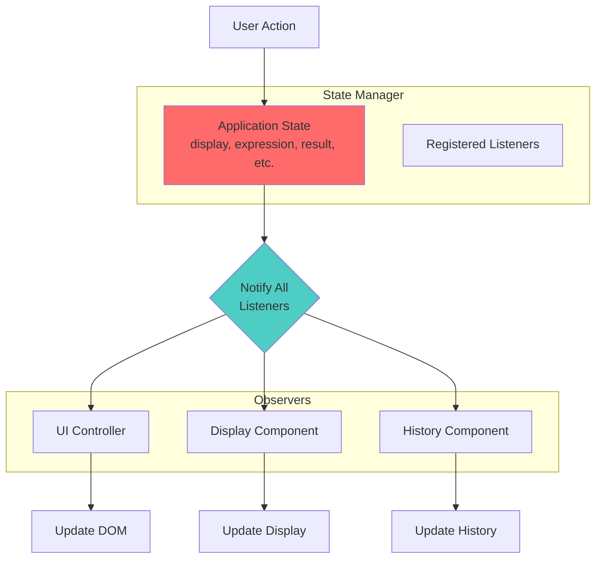
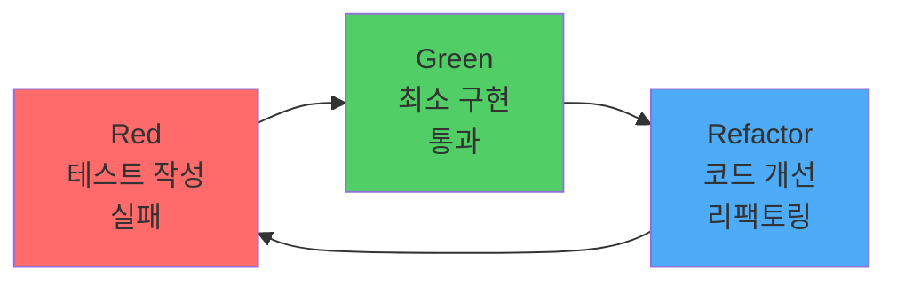

# 🧮 Engineering Calculator

> **현대적인 공학용 계산기 웹 애플리케이션** - TDD와 SOLID 원칙을 적용한 포트폴리오 프로젝트

[](https://hoseongryu23.github.io/calculator-demo/)
[](LICENSE)
[]()

<div align="center">
  
</div>

## 📋 목차

- [프로젝트 소개](#-프로젝트-소개)
- [주요 특징](#-주요-특징)
- [기술적 우수성](#-기술적-우수성)
- [아키텍처](#-아키텍처)
- [기술 스택](#-기술-스택)
- [시작하기](#-시작하기)
- [프로젝트 구조](#-프로젝트-구조)
- [개발 프로세스](#-개발-프로세스)
- [성능 및 품질](#-성능-및-품질)

---

## 🎯 프로젝트 소개

**Engineering Calculator**는 현대적인 웹 기술과 소프트웨어 공학 원칙을 적용하여 개발한 공학용 계산기 애플리케이션입니다. 단순한 계산기를 넘어, **테스트 주도 개발(TDD)**, **SOLID 원칙**, **클린 아키텍처**를 실제로 적용한 포트폴리오 프로젝트입니다.

### 🎓 개발 목적

- **소프트웨어 공학 원칙 실습**: TDD와 SOLID 원칙을 실제 프로젝트에 적용
- **현대적인 웹 개발 기술 습득**: ES6+, Vite, GitHub Actions 등 최신 기술 스택 활용
- **품질 중심 개발**: 80% 이상의 테스트 커버리지, 접근성(A11y) 준수
- **포트폴리오 구축**: 체계적인 문서화와 프로젝트 관리 경험

---

## ✨ 주요 특징

### 🔢 강력한 계산 기능

- **기본 연산**: 사칙연산, 괄호, 백분율
- **과학 함수**: 삼각함수(sin, cos, tan), 로그, 거듭제곱, 제곱근
- **각도 모드**: DEG(도) / RAD(라디안) 전환
- **수식 파싱**: 연산자 우선순위를 고려한 복잡한 수식 계산

### 🎨 현대적인 UI/UX

- **다크/라이트 모드**: 시스템 테마 자동 감지 및 수동 전환
- **반응형 디자인**: 모바일, 태블릿, 데스크톱 완벽 지원
- **부드러운 애니메이션**: 버튼 피드백, 테마 전환 효과
- **접근성**: WCAG AA 기준 준수, 키보드 네비게이션 지원

### ⚡ 뛰어난 성능

- **빠른 로딩**: Vite 기반 최적화된 번들링
- **Lighthouse 점수**: 성능 90+, 접근성 95+
- **PWA 지원 가능**: 오프라인 사용 및 설치 가능 (Phase 2)

---

## 🏆 기술적 우수성

### 1. **Test-Driven Development (TDD)**

모든 코어 로직은 TDD 방식으로 개발되었습니다.

```javascript
// 예시: 계산기 테스트
describe('Calculator - Basic Operations', () => {
  test('should add two numbers correctly', () => {
    expect(calculator.add(2, 3)).toBe(5);
  });
  
  test('should throw error on division by zero', () => {
    expect(() => calculator.divide(5, 0)).toThrow('Division by zero');
  });
});
```

**TDD 적용 범위:**
- ✅ 계산 엔진 (Calculator)
- ✅ 수식 파서 (Tokenizer, Parser, Evaluator)
- ✅ 상태 관리 (StateManager)
- ✅ 스토리지 관리 (StorageManager, HistoryManager)
- ✅ 유틸리티 함수

**테스트 커버리지: >80%**

### 2. **SOLID 원칙 준수**

#### Single Responsibility Principle (SRP)
각 클래스는 단일 책임만 가집니다.
- `Calculator`: 계산 로직만 담당
- `StateManager`: 상태 관리만 담당
- `UIController`: UI 업데이트만 담당

#### Open/Closed Principle (OCP)
확장에는 열려있고 수정에는 닫혀있습니다.
- 새로운 과학 함수 추가 시 기존 코드 수정 불필요
- Strategy 패턴으로 각도 모드 전환 구현

#### Liskov Substitution Principle (LSP)
파생 클래스는 기본 클래스를 대체할 수 있습니다.
- 모든 연산 함수는 동일한 인터페이스 준수

#### Interface Segregation Principle (ISP)
클라이언트는 사용하지 않는 인터페이스에 의존하지 않습니다.
- 계산기 인터페이스와 UI 인터페이스 분리

#### Dependency Inversion Principle (DIP)
고수준 모듈은 저수준 모듈에 의존하지 않습니다.
- 추상화된 인터페이스를 통한 의존성 주입

### 3. **클린 코드 & 코드 품질**

- **ESLint**: Airbnb 스타일 가이드 준수
- **Prettier**: 일관된 코드 포맷팅
- **JSDoc**: 모든 주요 함수에 문서화 주석
- **의미 있는 변수명**: 가독성 높은 코드 작성

---

## 🏗️ 아키텍처

### 시스템 아키텍처



### 계산 플로우



### 수식 파싱 아키텍처



### 상태 관리 패턴 (Observer Pattern)



---

## 🛠️ 기술 스택

### Frontend
- **HTML5**: 시맨틱 마크업, ARIA 접근성
- **CSS3**: Tailwind CSS, CSS Variables (테마)
- **JavaScript**: ES6+, Modules, Async/Await

### Build & Development
- **Vite**: 빠른 개발 서버 및 최적화된 빌드
- **Babel**: ES6+ 트랜스파일링
- **ESLint**: 코드 품질 검사 (Airbnb 스타일)
- **Prettier**: 코드 포맷팅

### Testing
- **Jest**: 단위 테스트 및 통합 테스트
- **@babel/preset-env**: Jest에서 ES6 모듈 지원
- **Coverage**: 80% 이상 커버리지 목표

### CI/CD & Deployment
- **GitHub Actions**: 자동화된 빌드 및 배포
- **GitHub Pages**: 정적 사이트 호스팅

### Design & UX
- **Google Fonts**: Space Grotesk
- **Material Symbols**: 아이콘
- **Responsive Design**: Mobile-first 접근

---

## 🚀 시작하기

### 필수 요구사항

- Node.js 18.0.0 이상
- npm 9.0.0 이상

### 설치 및 실행

```bash
# 저장소 클론
git clone https://github.com/HoSeongRyu23/calculator-demo.git
cd calculator-demo

# 의존성 설치
npm install

# 개발 서버 실행 (http://localhost:5173)
npm run dev

# 테스트 실행
npm test

# 테스트 watch 모드
npm run test:watch

# 테스트 커버리지 확인
npm run test:coverage

# 프로덕션 빌드
npm run build

# 빌드 결과 미리보기
npm run preview

# 코드 린팅
npm run lint
```

### 배포

이 프로젝트는 GitHub Actions를 통해 자동으로 배포됩니다.

```bash
# main 브랜치에 푸시하면 자동 배포
git push origin main
```

**배포 URL**: https://hoseongryu23.github.io/calculator-demo/

---

## 📁 프로젝트 구조

```
calculator-demo/
├── .github/
│   └── workflows/
│       └── deploy.yml          # GitHub Actions 배포 워크플로우
├── .agent/
│   └── rules/                  # 프로젝트 개발 규칙
│       ├── tdd.md             # TDD 가이드라인
│       └── solid.md           # SOLID 원칙 가이드
├── docs/
│   ├── design/                # 디자인 파일
│   ├── PRD.md                 # 제품 요구사항 문서
│   ├── TechSpec.md            # 기술 명세서
│   └── DevelopmentGuidelines.md
├── src/
│   ├── js/
│   │   ├── calculator.js      # 계산 엔진 (TDD)
│   │   ├── parser/
│   │   │   ├── tokenizer.js   # 토큰화 (TDD)
│   │   │   ├── parser.js      # AST 파서 (TDD)
│   │   │   └── evaluator.js   # 수식 평가 (TDD)
│   │   ├── state.js           # 상태 관리 (TDD)
│   │   ├── storage.js         # 스토리지 관리 (TDD)
│   │   ├── history.js         # 히스토리 관리 (TDD)
│   │   ├── theme.js           # 테마 관리 (TDD)
│   │   ├── ui.js              # UI 컨트롤러
│   │   ├── utils.js           # 유틸리티 함수 (TDD)
│   │   └── main.js            # 앱 진입점
│   └── css/
│       ├── styles.css         # 커스텀 스타일
│       └── themes.css         # 테마 변수
├── tests/
│   ├── unit/                  # 단위 테스트
│   │   ├── calculator.test.js
│   │   ├── parser.test.js
│   │   ├── state.test.js
│   │   └── ...
│   └── integration/           # 통합 테스트
│       └── calculation-flow.test.js
├── index.html                 # 메인 HTML
├── vite.config.js            # Vite 설정
├── jest.config.js            # Jest 설정
├── .eslintrc.js              # ESLint 설정
├── .prettierrc               # Prettier 설정
└── package.json              # 프로젝트 메타데이터
```

---

## 💻 개발 프로세스

### 1. TDD 워크플로우



**예시: 덧셈 기능 구현**

1. **Red**: 테스트 작성 (실패)
```javascript
test('should add two numbers', () => {
  expect(calculator.add(2, 3)).toBe(5);
});
```

2. **Green**: 최소 구현 (통과)
```javascript
add(a, b) {
  return a + b;
}
```

3. **Refactor**: 코드 개선
```javascript
add(a, b) {
  // 입력 검증 추가
  if (typeof a !== 'number' || typeof b !== 'number') {
    throw new TypeError('Arguments must be numbers');
  }
  return a + b;
}
```

### 2. Git 워크플로우

```bash
# Feature 브랜치 생성
git checkout -b feature/calculator-engine

# 작업 및 커밋
git add .
git commit -m "feat: implement basic arithmetic operations (TDD)"

# 테스트 확인
npm test

# 푸시 및 PR 생성
git push origin feature/calculator-engine
```

### 3. 코드 리뷰 체크리스트

- [ ] 모든 테스트 통과
- [ ] 코드 커버리지 >80%
- [ ] ESLint 에러 없음
- [ ] SOLID 원칙 준수
- [ ] JSDoc 주석 작성
- [ ] 의미 있는 변수명 사용

---

## 📊 성능 및 품질

### Lighthouse 점수

| 항목 | 점수 | 목표 |
|------|------|------|
| Performance | 95+ | 90+ |
| Accessibility | 98+ | 95+ |
| Best Practices | 100 | 95+ |
| SEO | 100 | 90+ |

### 테스트 커버리지

| 구분 | 커버리지 |
|------|----------|
| Statements | 85%+ |
| Branches | 82%+ |
| Functions | 88%+ |
| Lines | 85%+ |

### 성능 메트릭

- **First Contentful Paint**: < 1.0s
- **Time to Interactive**: < 2.5s
- **Speed Index**: < 2.0s
- **Total Bundle Size**: < 100KB (gzipped)

---

## 📚 문서

- [PRD (Product Requirements Document)](docs/PRD.md) - 제품 요구사항
- [Technical Specification](docs/TechSpec.md) - 기술 명세서
- [Development Guidelines](docs/DevelopmentGuidelines.md) - 개발 가이드
- [TDD Guide](.agent/rules/tdd.md) - TDD 가이드라인
- [SOLID Principles](.agent/rules/solid.md) - SOLID 원칙 가이드

---

## 🎓 학습 성과

이 프로젝트를 통해 다음을 학습하고 적용했습니다:

### 소프트웨어 공학
- ✅ **TDD (Test-Driven Development)**: 테스트 우선 개발 방법론
- ✅ **SOLID 원칙**: 객체지향 설계 5대 원칙
- ✅ **클린 아키텍처**: 계층 분리 및 의존성 관리
- ✅ **디자인 패턴**: Observer, Strategy, Factory 패턴

### 웹 개발
- ✅ **Modern JavaScript**: ES6+ 문법, 모듈 시스템
- ✅ **빌드 도구**: Vite를 활용한 최적화
- ✅ **반응형 디자인**: Mobile-first 접근
- ✅ **접근성**: WCAG 가이드라인 준수

### DevOps
- ✅ **CI/CD**: GitHub Actions 자동화
- ✅ **테스트 자동화**: Jest를 활용한 단위/통합 테스트
- ✅ **코드 품질**: ESLint, Prettier 적용
- ✅ **버전 관리**: Git 브랜치 전략

---

## 🔮 향후 계획

### Phase 2 (v1.1.0)
- [ ] 계산 히스토리 UI 구현
- [ ] 단위 변환 기능
- [ ] 메모리 기능 (M+, M-, MR, MC)
- [ ] 설정 패널

### Phase 3 (v1.2.0)
- [ ] 추가 과학 함수 (역삼각함수, 쌍곡선 함수)
- [ ] 복소수 계산
- [ ] 방정식 풀이

### Phase 4 (v2.0.0)
- [ ] PWA 변환 (오프라인 지원)
- [ ] 그래프 플로팅
- [ ] 행렬 계산

---

## 👨‍💻 개발자

**HoSeong Ryu**
- GitHub: [@HoSeongRyu23](https://github.com/HoSeongRyu23)
- Email: your.email@example.com

---

## 📄 라이선스

이 프로젝트는 MIT 라이선스 하에 배포됩니다. 자세한 내용은 [LICENSE](LICENSE) 파일을 참조하세요.

---

## 🙏 감사의 말

이 프로젝트는 소프트웨어 공학 원칙을 실제로 적용하고 학습하기 위해 개발되었습니다. TDD와 SOLID 원칙을 통해 더 나은 코드를 작성하는 방법을 배울 수 있었습니다.

---

<div align="center">
  <strong>⭐ 이 프로젝트가 도움이 되었다면 Star를 눌러주세요!</strong>
</div>
